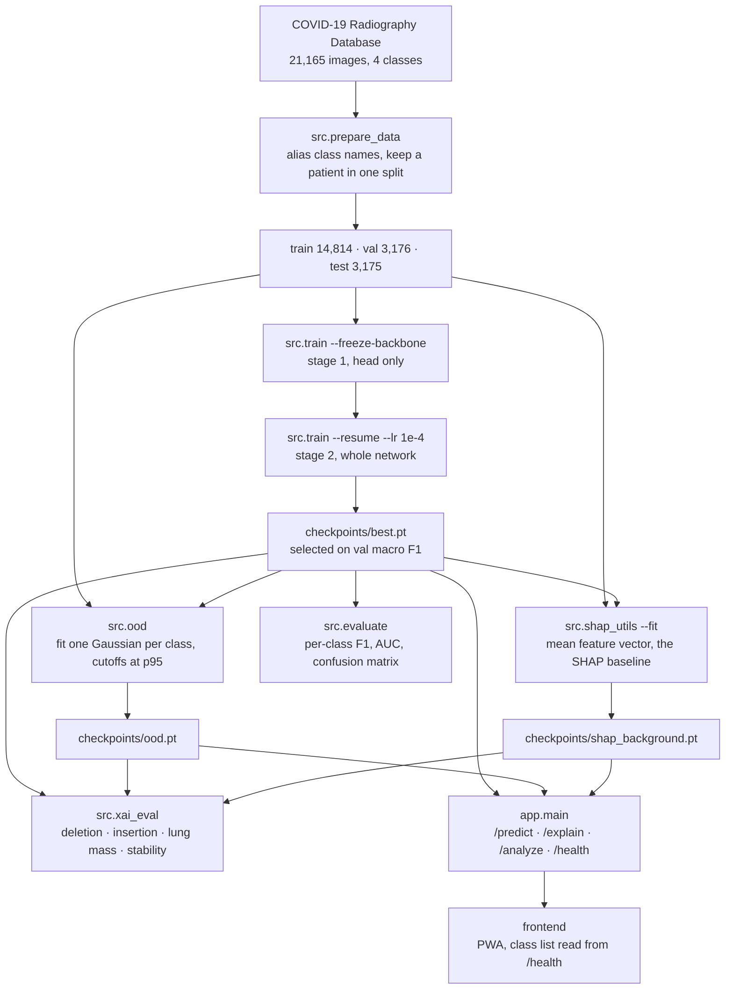
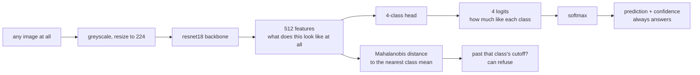

# Chest X-ray classifier

A four-class CNN over chest radiographs: **NORMAL**, **PNEUMONIA**, **COVID19**,
**LUNG_OPACITY**.

It lives beside the triage app but does not import from it and is not wired into
it. The triage backend reads symptom text; this reads an image. Keeping them
apart means the backend does not have to carry a multi-gigabyte torch install.

## What this is not

This is a research prototype trained on public datasets. It is not a medical
device, it has not been validated on any clinical population, and a number it
returns is not a finding. Four specific reasons to distrust it, beyond the
usual:

- **The public COVID-19 X-ray sets are assembled from different sources per
  class.** A model can separate them by scanner, exposure or burned-in
  annotation and never look at a lung. This is not a hypothetical here, and it
  is not a risk this repo merely warns about — it was measured. Every COVID-19
  image in the Radiography Database comes from BIMCV, Eurorad, SIRM or GitHub;
  every Normal and Viral Pneumonia image comes from Kaggle. Zero overlap. The
  classes are perfectly separable by provenance before any lung is examined.
  See [Results](#results). Run Grad-CAM before believing any score. Scoring
  against a second download does not settle it either — that dataset turned out
  to share 24.0% of its images with this one's training split, and the rest
  comes from the same public archives.
- **The label is not the disease.** These labels came from whoever assembled
  the dataset, by varying and mostly undocumented criteria — some RT-PCR
  confirmed, some radiologist-read, some neither.
- **The class balance is not the real prevalence.** Nothing here estimates how
  likely a given patient is to have anything.
- **Four classes is not every finding, and NORMAL does not mean clear.**
  LUNG_OPACITY is a class here only because leaving it out was measurably
  worse: the three-class model met those films anyway and called them NORMAL
  94.2% of the time at a mean confidence of 0.972. Adding a class fixes that
  one case and not the general one. Effusion, pneumothorax, nodules and
  everything else still have no output and still land on whichever class is
  nearest. **NORMAL means "not the other three", never "clear".**

Grad-CAM is included for exactly this reason. It is not decoration, and it was
measured rather than assumed to work: see [Are the explanations any good?
](#are-the-explanations-any-good). SHAP sits beside it and answers a different
question — how much each learned feature moved the logit — but note that its
baseline is the average training image, so it **inherits the provenance
confound rather than detecting it**. Neither explanation can settle the
question in the first bullet above.

## At a glance

resnet18, two-stage fine-tuning, 21,165 images from the COVID-19 Radiography
Database split 70/15/15 by patient group. Roughly half this repository is the
model; the other half is the machinery for deciding whether its numbers mean
anything.

### How a number gets made



### Why softmax cannot say "none of the above"

One forward pass, two answers taken from different depths. The top path always
returns a class, whatever it is handed. Only the bottom path can decline.



A flat grey square comes back COVID19 at 99.4% with `low_confidence` unflagged.
The distance check refuses it, and the other five probes, at 1,594 to 21,485
against a cutoff of 939.8.

### Results

| four-class, 3,175 test images | macro F1 | accuracy |
|---|---|---|
| as downloaded | 0.9587 | 0.9524 |
| the same with resnet50, 2.1x the parameters | 0.9576 | 0.9512 |
| *(both are single runs — three seeds each put them 0.93 sd apart)* | | |
| lungs only, 77% of each image masked | 0.9341 | 0.9298 |
| second dataset, clean, restricted | 0.9452 | 0.9675 |

**Do not quote any of these alone.** The classes are 100% separable by
provenance, so a high score is what a model would produce by learning which
repository an image came from. The rest of this file is largely about that.

### What the machinery establishes

| question | answered by | finding |
|---|---|---|
| Does it read lungs or artifacts? | `src.mask_lungs` | Masking costs COVID-19 −0.056 F1 against NORMAL's −0.009. It is the only class with unique provenance, so it has the most artifact to lose. |
| Is the second dataset different data? | `src.dataset_overlap` | 24.0% of it is already in the training split, and **zero** of those match by checksum — every copy was re-encoded on the way in. |
| Does it hold up off-dataset? | `src.cross_dataset` | 0.9452 macro F1 on the clean remainder, after the shared images are removed and reported separately. |
| Does the refusal check still work? | `src.probe_ood` | All six non-radiographs refused; all six still called COVID19 above 98.7% by the softmax. |
| What did NORMAL used to hide? | the class list itself | The three-class model called lung opacity films NORMAL 94.2% of the time at 0.972 confidence. Adding the class moved that error onto the confusion matrix. |
| Do the heatmaps point at pixels the model uses? | `src.xai_eval` | Insertion, yes: +0.34 over a random ordering on resnet18 and +0.60 on resnet50. Deletion says no on both — and 59.7% / 72.6% of its steps are refused by the OOD check, which is why. |
| Is the heat in the lungs? | `src.xai_eval` | Enrichment 1.359 (resnet18) and 1.274 (resnet50) over a uniform map. Modest, and it is lung-field mass rather than pathology IoU. |
| Is there a short list of features behind a decision? | `src.shap_utils` | No. The top 15 carry 15.1% of the movement on resnet18, 14.2% on resnet50. |
| Do these explanation scores compare across models? | `src.xai_eval` | Not raw. The random controls differ (0.44 vs 0.27) and cosine falls with dimension, so only gaps and ratios transfer. |
| Does a bigger backbone help? | `--backbone resnet50`, 3 seeds each | No. 2.1x the parameters is worth −0.0023 macro F1 against a pooled sd of 0.0025 — inside the noise, and it doubles the run-to-run spread. |

### Where to look

- Numbers and what they cost: [Results](#results)
- The provenance problem, measured: [The lung-masking check](#the-lung-masking-check)
- Off-dataset scoring: [Scored against a second dataset](#scored-against-a-second-dataset)
- Refusing non-radiographs: [Is it even a chest X-ray?](#is-it-even-a-chest-x-ray)
- Per-feature attributions: [SHAP](#shap)
- Whether either explanation is worth reading: [Are the explanations any good?](#are-the-explanations-any-good)

## Layout

```
src/dataset.py         loaders, transforms, the two imbalance corrections
src/model.py           backbone + 4-class head, checkpoint save/load
src/train.py           fine-tuning loop, selects on macro F1
src/evaluate.py        per-class report and confusion matrix
src/ood.py             fits the "is this even a chest X-ray" check
src/probe_ood.py       scores six non-radiographs, to check that it still works
src/gradcam_utils.py   heatmaps, and a CLI for one image
src/shap_utils.py      per-feature attributions, exact for a linear head
src/xai_eval.py        scores the explanations themselves, not the predictions
src/prepare_data.py    normalise a download into data/{train,val,test}/CLASS/
src/dataset_overlap.py whether two datasets share images, before trusting one
src/cross_dataset.py   score a second dataset with the shared images removed
src/mask_lungs.py      mirror a split with everything outside the lungs blacked out
src/synth_data.py      drawn stand-in images, for testing the pipeline
app/main.py            FastAPI service: /health, /predict, /explain, /analyze
tests/                 pytest suite, no dataset and no network needed
paper/                 write-up drafted against the numbers above
```

## Setup

Shares one `smt` venv with the sibling `smart-healthcare-triage` checkout
rather than standing up a second one, since torch is the same multi-gigabyte
install either way. It lives **outside** both project folders, at `~/venvs/smt`.
Both projects sit under OneDrive, and a 4.8 GB venv has no business in a synced
folder: it rebuilds from `requirements.txt` in one command, it is thousands of
small files that sync slowly, and it is path- and platform-specific enough that
a synced copy would not run on another machine anyway.

Install torch from the index that matches your hardware **first** — see the
header of `requirements.txt`. On this machine (RTX 5070 Ti Laptop, Blackwell /
sm_120) that is the CUDA 12.8 build:

```bash
~/venvs/smt/Scripts/python.exe -m pip install torch torchvision --index-url https://download.pytorch.org/whl/cu128
```

Then the rest:

```bash
~/venvs/smt/Scripts/python.exe -m pip install -r requirements.txt
```

Every command below runs from `chest-xray-classifier/`. The interpreter is
called by path rather than by activating the venv, which keeps these commands
byte-identical in PowerShell and in bash — `~` expands in both.

Always `python -m <module>`, never the bare `pytest` / `uvicorn` / `kaggle`
launchers sitting in `Scripts/`. Those compile the interpreter's absolute path
in at install time and broke when the venv was relocated out of OneDrive. The
`-m` form does not care where the venv lives.

## Quick start, with no download

`src/synth_data.py` draws stand-in images so the pipeline can be exercised
before committing to a several-gigabyte download:

```bash
~/venvs/smt/Scripts/python.exe -m src.synth_data --out data --per-class 120
```

They are ellipses and Gaussian blobs with a per-class pattern drawn to be
learnable. Training on them proves gradients flow and the loaders are wired up
correctly. **It proves nothing about pneumonia.** Do not report a number that
came from these.

## Real data

Neither dataset is redistributed here; both need a Kaggle account.

**COVID-19 Radiography Database** — 21k images, the most widely used.
`kaggle datasets download -d tawsifurrahman/covid19-radiography-database`

**Chest X-ray (COVID-19 & Pneumonia)** — smaller, already split.
`kaggle datasets download -d prashant268/chest-xray-covid19-pneumonia`

Before scoring one against a model trained on the other, check that they are
actually different data — compiled Kaggle sets frequently re-package the same
source collections, and a resized or re-encoded copy has different bytes while
being the same radiograph:

```bash
~/venvs/smt/Scripts/python.exe -m src.dataset_overlap --left ~/Downloads/chest-xray-cp --right ~/Downloads/covid19-radiography
```

It compares contrast-normalised thumbnails, not a perceptual hash. A 64-bit
difference hash is the usual tool and it is useless here: every chest
radiograph shares a silhouette, so at 8x8 they collapse together, and 89% of
*independent* normal films landed within hamming distance 5 of some COVID film.
That fails in the direction that discards a valid experiment. See the module
docstring for the two controls the thresholds were read off.

Unzip anywhere, then normalise it into the layout the loaders expect:

```bash
~/venvs/smt/Scripts/python.exe -m src.prepare_data --source ~/Downloads/COVID-19_Radiography_Dataset --out data
```

`prepare_data` handles the naming differences between the two ("COVID" vs
"COVID19", "Viral Pneumonia" vs "PNEUMONIA", "Lung_Opacity" vs "LUNG_OPACITY").
Lung opacity is kept as its own class and never folded into pneumonia — it is a
broader finding, and merging them would change what the model claims to detect.

**Only the Radiography Database has all four.** The smaller Kermany-derived sets
carry no lung opacity directory, so they cannot train this model; `prepare_data`
stops with a message rather than writing a split with a class missing, which
ImageFolder would silently renumber the rest around.

It also **keeps one patient's images in a single split**. The Kermany pneumonia
images are named `person1_virus_6`, `person1_bacteria_1` and so on — several
films of the same chest. Split those at random and the same patient appears in
train and test, which inflates the test score by several points. This is why
the published train/test split is pooled and redone rather than used as-is.

## Train

```bash
~/venvs/smt/Scripts/python.exe -m src.train --epochs 15 --freeze-backbone --num-workers 4 --out checkpoints/stage1.pt
~/venvs/smt/Scripts/python.exe -m src.train --epochs 25 --lr 1e-4 --num-workers 4 --resume checkpoints/stage1.pt --out checkpoints/best.pt
```

**Pass `--num-workers`.** It defaults to 0 because a worker on Windows
re-imports the calling module and deadlocks unless the entry point is guarded,
and `build_loader` is called from places that are not. `python -m src.train` is
guarded, so workers are safe there — and they matter: decoding 21k JPEGs on one
thread left this GPU 12% busy at roughly 3 minutes an epoch. With four workers
it sat near 50% and under a minute, which is the difference between a coffee
and an afternoon.

The second stage lands on `checkpoints/best.pt`, which is where `src.evaluate`,
`src.gradcam_utils` and the API all look by default. `--out` is spelled out
above only because stage 1 names its own file and the asymmetry reads as though
stage 2 goes somewhere unstated; it is the default either way.

Head first, then unfreeze. Fine-tuning a whole resnet against a few hundred
images per class mostly memorises them.

`--resume` is what joins the two, and leaving it off is the quiet way to get
this wrong: the second command would otherwise rebuild from ImageNet weights
and throw the first one's epochs away, which looks identical in the logs. It
restores weights only — the optimizer and the LR schedule start clean, since
AdamW moments gathered while the backbone was frozen say nothing about the
parameters the second stage unfreezes.

Write the stages to separate files. `--resume` refuses to run when `--out`
names the same path, rather than consuming the checkpoint it started from.

Selection is on **macro F1, not accuracy**. With COVID-19 at a tenth of the
pneumonia count, a model that never predicts it can still post a high accuracy,
and selecting on accuracy would faithfully keep that model.

`--imbalance` picks the correction: `sampler` (default, oversample rare classes)
or `loss` (weight the loss). Use one. Both together over-corrects and the model
starts crying wolf.

## Evaluate

```bash
~/venvs/smt/Scripts/python.exe -m src.evaluate --checkpoint checkpoints/best.pt --split test
```

Read the per-class recall, not the accuracy. A model at 94% accuracy that
recalls 60% of COVID-19 cases is useless for the thing you would want it for,
and only the confusion matrix shows that. Writes
`reports/confusion_test.png` and `reports/metrics_test.json`.

The JSON carries per-class precision, recall, F1, one-vs-rest AUC and support
under `per_class`, plus the macro averages. Keys are only ever added to that
file and never renamed — every number quoted below was read out of one, and the
older runs under `reports/` are not going to be regenerated.

Then fit the out-of-distribution check, which the API needs before it can tell
whether an upload is a chest X-ray at all — see
[Is it even a chest X-ray?](#is-it-even-a-chest-x-ray):

```bash
~/venvs/smt/Scripts/python.exe -m src.ood --checkpoint checkpoints/best.pt --out checkpoints/ood.pt
```

## Grad-CAM

```bash
~/venvs/smt/Scripts/python.exe -m src.gradcam_utils --checkpoint checkpoints/best.pt --image data/test/PNEUMONIA/00001_person1_virus_6.jpeg --out cam.png
```

`--class-name` explains a class other than the predicted one, which is how you
ask why the model did *not* say pneumonia.

Check a handful of correct predictions before trusting a score. If the heat sits
on a corner marker or outside the lungs, the model found a shortcut.

Be aware of what this check cannot do. Scanner, exposure and processing
signature is present *inside* the lung fields as well as around them, so a
model reading provenance rather than pathology still produces heatmaps that
look anatomically sensible. Heat on the lungs is necessary, not sufficient.

## SHAP

Grad-CAM says *where*. It cannot say *how much*, and two heatmaps that look
alike can come from quite different reasons. `src/shap_utils.py` answers the
other half: of the 512 numbers the classification head actually reads, which
ones pushed the prediction up, which pushed it down, and by how many logits
each.

```bash
~/venvs/smt/Scripts/python.exe -m src.shap_utils --fit --checkpoint checkpoints/best.pt --data-dir ~/cxr-data-4class
~/venvs/smt/Scripts/python.exe -m src.shap_utils --checkpoint checkpoints/best.pt --image ~/cxr-data-4class/test/COVID19/00000_COVID-1447.png --out reports/shap_covid19.png
```

The attribution is over the **penultimate features, not the pixels**. That is
what makes it complementary rather than a second opinion: pixel-level SHAP
would produce another spatial map, and the project would then have two answers
to "where" and none to "how much".

It is also **exact**. The head is one `nn.Linear` over those features, so the
logit is `w · x + b` and nothing else, and for a linear model the Shapley
values have a closed form — `φᵢ = wᵢ(xᵢ − E[xᵢ])`, with no sampling and no
convergence to check. Sum the contributions, add the base value, and the logit
comes back exactly. That identity is the Shapley efficiency axiom and it is
asserted in `tests/test_shap.py` rather than assumed, alongside a test that
these are the same numbers `shap.LinearExplainer` produces. The closed form is
what runs at serving time, so a deployment does not need the `shap` package;
the cross-check is what entitles the work to cite Lundberg & Lee for these
numbers.

`--against CLASS` explains the *margin* over another class rather than the
logit itself, which is what an argmax actually decides. It is the SHAP
counterpart to `--class-name` on Grad-CAM.

**Four things it does not tell you**, and they are why the module docstring is
as long as it is:

- **A feature index is not a clinical concept.** "Feature 453 contributed
  +0.44 logits" is a true statement about the network and says nothing to a
  radiologist. None of the 512 is "consolidation". `--channel-map` writes out
  where the channel behind a contribution actually fires, which closes some of
  that gap and does not close it.
- **The features are correlated; this treats them as independent.** That is the
  standard interventional assumption and it is what `shap.LinearExplainer` does
  by default, but it is an assumption. `src.ood` already estimates the
  covariance of exactly these features.
- **It explains logits, not probabilities.** Softmax is not additive, so no
  decomposition of a probability sums to that probability.
- **The baseline carries the training set's provenance.** `E[x]` is the mean
  feature vector over training images, so every contribution is measured
  against the average image *in this dataset* — not against a healthy chest.
  Given that the classes here are separable by source archive, a large
  contribution is as consistent with "unlike the average scanner" as with
  "unlike a healthy lung". **SHAP inherits the confound; it does not detect
  it.**

## Are the explanations any good?

Everything above measures the classifier. `src/xai_eval.py` measures whether
Grad-CAM and SHAP are describing what the classifier actually did.

```bash
~/venvs/smt/Scripts/python.exe -m src.xai_eval --checkpoint checkpoints/best.pt --data-dir ~/cxr-data-4class --limit 200 --masks ~/Downloads/covid19-radiography/COVID-19_Radiography_Dataset --ood-stats checkpoints/ood.pt
```

The OOD statistics and the SHAP background are both fingerprint-locked to a
checkpoint, so a second backbone needs its own before it can be scored:

```bash
~/venvs/smt/Scripts/python.exe -m src.ood --checkpoint checkpoints/r50_best.pt --data-dir ~/cxr-data-4class --num-workers 4 --out checkpoints/r50_ood.pt
~/venvs/smt/Scripts/python.exe -m src.shap_utils --fit --checkpoint checkpoints/r50_best.pt --data-dir ~/cxr-data-4class --num-workers 4 --background checkpoints/r50_shap_background.pt
~/venvs/smt/Scripts/python.exe -m src.xai_eval --checkpoint checkpoints/r50_best.pt --data-dir ~/cxr-data-4class --limit 200 --masks ~/Downloads/covid19-radiography/COVID-19_Radiography_Dataset --ood-stats checkpoints/r50_ood.pt --background checkpoints/r50_shap_background.pt --report-dir reports/resnet50
```

200 test images sampled at random across the split (33 COVID19, 48
LUNG_OPACITY, 102 NORMAL, 17 PNEUMONIA — it samples rather than taking the
first N, which on a class-sorted `ImageFolder` would have been 200 COVID-19
films wearing a split-wide label). The sample and the random controls come from
a seeded generator, so both backbones below score **the identical 200 images
under the identical control orderings**:

| | resnet18 | random | gap | resnet50 | random | gap |
|---|---|---|---|---|---|---|
| deletion AUC *(lower better)* | 0.4503 | 0.4400 | +0.0103 | 0.4282 | 0.2738 | **+0.1543** |
| insertion AUC *(higher better)* | 0.7764 | 0.4364 | +0.3400 | **0.8700** | 0.2740 | **+0.5960** |
| deletion steps refused as OOD | | | 59.7% | | | **72.6%** |

Deletion and insertion are from Petsiuk et al. 2018. Both are reported against
a random pixel ordering because an AUC on its own has no scale — a map that
ranks pixels arbitrarily still produces a curve, and only the gap means
anything.

**The raw AUCs are not comparable between the two models, which is the first
thing this table is for.** resnet50's probability collapses much faster under
random perturbation (random insertion 0.2740 against resnet18's 0.4364), so its
curves start somewhere else entirely. Reading its 0.8700 next to resnet18's
0.7764 and concluding the bigger model is better explained compares two numbers
measured from different origins. By the gap — the only comparable part — it
genuinely is better localised: +0.5960 against +0.3400.

**Insertion works and deletion does not, on both.** Restoring the pixels
Grad-CAM ranks highest recovers the prediction far faster than restoring random
ones. Deleting them destroys it no faster than deleting random ones — slower,
in fact, the gap being positive on both models when it should be negative. The
two metrics are supposed to agree.

The reason is measurable here rather than arguable, which is the point of
running the OOD check alongside: **59.7% of resnet18's deletion steps and 72.6%
of resnet50's are refused by that model's own out-of-distribution detector.**
Blanking pixels produces something that is no longer a chest X-ray, so a
probability that falls after deletion is partly reporting "this is not a
radiograph" rather than "the evidence is gone".

The second backbone turns that from a story into a prediction that held: the
model with more off-distribution perturbations is the one whose deletion result
is further wrong, *while being the better-localised model on insertion*. The
two metrics rank the backbones in opposite orders and the refusal rate says
which ranking to believe. **Quote the insertion gap; the deletion number is
measuring the baseline as much as the map.**

### Is the heat inside the lungs?

| | resnet18 | resnet50 |
|---|---|---|
| Grad-CAM mass inside the lung fields | 0.324 | 0.304 |
| lung fields as a share of the image | 0.238 | 0.238 |
| **enrichment** | **1.359** | **1.274** |

Read the last row. A map that has localised nothing already puts about a
quarter of its mass in the lungs, because the lungs are about a quarter of a
chest radiograph, so 0.324 on its own is close to meaningless. Enrichment is
the ratio, and 1.0 is exactly what a uniform map achieves. At 1.36 and 1.27 the
heatmaps are pointing at the lungs — modestly. Note that resnet50, the better
model on insertion, is slightly *worse* here: staying inside the lung fields
and finding the evidence are not the same property.

**This is not IoU against annotated pathology**, and the difference is large
enough to state twice. The masks shipped with the Radiography Database segment
*lungs*, not findings, so a map covering both entire lungs scores perfectly
here while having localised nothing in particular. Real explanation-fidelity
IoU needs boxes this dataset does not carry — the RSNA Pneumonia Detection set,
or the 984 annotated images in NIH ChestX-ray14.

### Do similar cases get similar explanations?

| mean pairwise cosine | resnet18 *(512-d)* | resnet50 *(2048-d)* |
|---|---|---|
| within class | 0.6076 | 0.3118 |
| all pairs *(control)* | 0.3142 | 0.1479 |
| **ratio** | **1.93** | **2.11** |

**The absolute numbers halve between the models and the ratio does not move.**
That is the clearest demonstration here of why the control is load-bearing.
Cosine similarity falls with dimension as pure geometry, so resnet50's 0.31
read alone suggests its explanations are half as consistent; against its own
control they are, if anything, marginally more so. An absolute
attribution-similarity figure does not transfer between architectures.

The control is not optional within one model either. Every SHAP vector here is
`w ⊙ (x − E[x])` for one shared `w`, so any two of them agree in direction
before anything about the images is considered, and a within-class figure read
alone is partly reporting arithmetic. At roughly double the control on both
networks, the consistency is real.

**The top 15 features account for 15.1% of the total movement on resnet18 and
14.2% on resnet50.** That is the number that decides how a bar chart should be
read, and it is the least comfortable result here: there is no compact
feature-level explanation of either model's decisions. A chart of 15 bars is a
sample of the reasoning, not a summary of it, and `/analyze` returns the
coverage alongside the bars so a client cannot present them as "the reason"
without contradicting the payload it was sent.

The two look alike in that row and are not alike underneath it: resnet50
spreads its attribution over 2,048 features rather than 512, so reaching a
comparable 14.2% in fifteen of them is **19.3x** the uniform expectation
against resnet18's 5.2x. Raw coverage governs the caption; concentration over
uniform governs whether the representation is distributed.

## Results

resnet18, COVID-19 Radiography Database, 21,165 images split 70/15/15 with the
two-stage recipe above. Test set, 3,175 images:

| four-class | macro F1 | accuracy | macro AUC | COVID19 F1 | LUNG_OPACITY F1 | NORMAL F1 | PNEUMONIA F1 |
|---|---|---|---|---|---|---|---|
| resnet18, as downloaded | 0.9587 | 0.9524 | 0.9928 | 0.982 | 0.929 | 0.953 | 0.970 |
| resnet50, as downloaded | 0.9576 | 0.9512 | 0.9937 | 0.982 | 0.925 | 0.952 | 0.970 |

Those two rows are single runs, and comparing them directly is a trap. Three
seeds of each, identical recipe, varying only `--seed`:

| macro F1 | seed 42 | seed 1 | seed 2 | mean | sd | range |
|---|---|---|---|---|---|---|
| resnet18 | 0.9587 | 0.9570 | 0.9556 | **0.9571** | 0.0016 | 0.0031 |
| resnet50 | 0.9576 | 0.9510 | 0.9558 | **0.9548** | 0.0034 | 0.0065 |

**resnet50 buys nothing, and the seeds are what let that be said.** The means
differ by −0.0023 against a pooled sd of 0.0025 — 0.93 standard deviations,
with the ranges overlapping heavily — so the difference is not distinguishable
from run-to-run noise. For scale, masking the lungs moves macro F1 by 0.0246,
ten times further.

**Compare the seed-42 runs alone and you get −0.0011, less than half that**,
because that resnet18 run is the best of its three and that resnet50 run the
best of its three. Depending on which pair you happened to train, the sign
could come out either way. This paragraph previously quoted that single-run
figure; it was out by a factor of two, and the seed study is the only reason
that is known.

Two things do survive. **resnet50 is twice as unstable** — sd 0.0034 against
0.0016 — so the larger model is more dependent on initialisation, the opposite
of what capacity is meant to buy. And **every resnet50 run beats every
resnet18 run on macro AUC** (0.9930–0.9937 against 0.9919–0.9928, no overlap)
while macro F1 shows no separation at all. It ranks better and decides no
better, which is the same split that shows up under masking, where AUC falls
eight times less than F1.

The straightforward reading of the flat capacity curve: if a large part of the
score is available from acquisition signature, the smaller network has already
taken it and extra capacity has nothing left to buy. Reproduce with:

```bash
~/venvs/smt/Scripts/python.exe -m src.train --epochs 15 --freeze-backbone --num-workers 4 --backbone resnet50 --data-dir ~/cxr-data-4class --out checkpoints/r50_stage1.pt
~/venvs/smt/Scripts/python.exe -m src.train --epochs 25 --lr 1e-4 --num-workers 4 --data-dir ~/cxr-data-4class --resume checkpoints/r50_stage1.pt --out checkpoints/r50_best.pt
~/venvs/smt/Scripts/python.exe -m src.evaluate --checkpoint checkpoints/r50_best.pt --data-dir ~/cxr-data-4class --split test --report-dir reports/resnet50
```

For another seed, pass `--seed` to **both** stages and give every artefact its
own name — the recipe is otherwise identical:

```bash
~/venvs/smt/Scripts/python.exe -m src.train --epochs 15 --freeze-backbone --num-workers 4 --data-dir ~/cxr-data-4class --seed 1 --out checkpoints/seed1_stage1.pt
~/venvs/smt/Scripts/python.exe -m src.train --epochs 25 --lr 1e-4 --num-workers 4 --data-dir ~/cxr-data-4class --seed 1 --resume checkpoints/seed1_stage1.pt --out checkpoints/seed1_best.pt
~/venvs/smt/Scripts/python.exe -m src.evaluate --checkpoint checkpoints/seed1_best.pt --data-dir ~/cxr-data-4class --split test --report-dir reports/seed1
```

`--seed` moves the head initialisation, the sampler draws and the augmentation
order. It does **not** move the split, which `prepare_data` already fixed on
disk — so this measures training-run variance on one partition, not the wider
variance you would get from redrawing the split as well.

Per-class one-vs-rest AUC, resnet18: COVID19 0.9993, LUNG_OPACITY 0.9858,
NORMAL 0.9870, PNEUMONIA 0.9992. AUC is threshold-free, so it asks whether the model *ranks*
the positives above the negatives rather than whether argmax lands correctly.
That makes it the number least disturbed by the class imbalance and the number
furthest from what the served model does, since serving takes an argmax. It is
in the table because a reader will ask for it; read the per-class recall.

**Do not quote these on their own.** The classes in this dataset are 100%
separable by provenance — see [What this is not](#what-this-is-not) — so a high
score is exactly what a model would produce by learning which repository an
image came from.

The headline number went down when the class was added, 0.9816 → 0.9587. Read
those two side by side with care. They are macro F1 over different class sets on
different test splits, 2,273 images then and 3,175 now, so the difference is not
a like-for-like regression on a fixed task.

The two splits are not nested either, and the reason is worth knowing before you
compare any two runs here. `prepare_data` draws from one `random.Random(seed)`
inside its loop over `CLASSES`, so inserting a class shifts the stream for every
class sorting after it — the same seed puts different NORMAL and PNEUMONIA
images in test than it did with three classes. The per-class counts are
identical (542 / 1529 / 202) only because each class lands on its 15% by
construction, which makes them no evidence at all that the images are the same.
COVID19 sorts first and is unaffected.

With that said, the per-class columns are the closest thing to a like-for-like
view, and they say where the loss went:

| F1 | COVID19 | NORMAL | PNEUMONIA |
|---|---|---|---|
| three-class | 0.993 | 0.992 | 0.960 |
| four-class | 0.982 | 0.953 | 0.970 |

**NORMAL took almost all of the loss**, 0.992 → 0.953, and pneumonia went up.
That is the shape you would predict if the three-class NORMAL had been quietly
absorbing lung opacity films, which is exactly what it was doing: shown 600 of
them it called 94.2% NORMAL at a mean confidence of 0.972, and reported nothing
unusual about any of it. The four-class model gets them wrong differently — 72
of 902 still land on NORMAL, and 48 normal films now come back LUNG_OPACITY,
which is why LUNG_OPACITY is the weakest class at 0.929.

The confusion is real either way. The difference is that it is now on the
confusion matrix instead of inside the NORMAL column, so the drop is a failure
becoming visible rather than one being introduced.

### The lung-masking check

| four-class | macro F1 | accuracy | macro AUC | COVID19 F1 | LUNG_OPACITY F1 | NORMAL F1 | PNEUMONIA F1 |
|---|---|---|---|---|---|---|---|
| as downloaded | 0.9587 | 0.9524 | 0.9928 | 0.982 | 0.929 | 0.953 | 0.970 |
| lungs only    | 0.9341 | 0.9298 | 0.9898 | 0.926 | 0.899 | 0.944 | 0.967 |

The second row is the same recipe trained on a mirror of the same split with
every non-lung pixel zeroed. Roughly 77% of each image is removed, including all
burned-in markers, collimation edges, soft tissue and background. The score fell
by two and a half points rather than collapsing. To reproduce it:

```bash
~/venvs/smt/Scripts/python.exe -m src.mask_lungs --split-root ~/cxr-data-4class --source ~/Downloads/covid19-radiography/COVID-19_Radiography_Dataset --out ~/cxr-data-4class-masked
~/venvs/smt/Scripts/python.exe -m src.train --epochs 15 --freeze-backbone --num-workers 4 --data-dir ~/cxr-data-4class-masked --out checkpoints/masked_stage1.pt
~/venvs/smt/Scripts/python.exe -m src.train --epochs 25 --lr 1e-4 --num-workers 4 --data-dir ~/cxr-data-4class-masked --resume checkpoints/masked_stage1.pt --out checkpoints/masked_best.pt
~/venvs/smt/Scripts/python.exe -m src.evaluate --checkpoint checkpoints/masked_best.pt --split test --data-dir ~/cxr-data-4class-masked --report-dir reports/masked_4class
```

It mirrors an existing split rather than re-splitting, so the two runs differ in
exactly one variable. Masks ship with the Radiography Database, for all four
classes; most other downloads have none. Pass `--report-dir`, or the evaluation
overwrites the unmasked run's saved metrics.

What that establishes, and what it does not:

- It **rules out** the crude shortcut. The model is not reading annotations or
  background, because those are gone and it still scores 0.93.
- It **does not clear** the provenance confound. Acquisition signature survives
  inside lung pixels, and so does the lung silhouette — a child's lungs are
  shaped differently from an adult's, and Viral Pneumonia here is the paediatric
  Kermany collection while COVID-19 is adult European patients.

One detail argues that part of the original score *was* artifact, and it is the
clearest signal in this table. Masking costs the four classes wildly different
amounts:

| | COVID19 | LUNG_OPACITY | NORMAL | PNEUMONIA |
|---|---|---|---|---|
| F1 lost to masking | −0.056 | −0.030 | −0.009 | −0.003 |
| AUC lost to masking | −0.0040 | −0.0057 | −0.0015 | −0.0011 |

COVID-19 loses six times what NORMAL does and nearly twenty times what pneumonia
does, and its recall falls 0.976 → 0.911. It is the only class with unique
provenance, so it is the class with the most artifact to lose. The three-class
version of this experiment found the same thing at half the magnitude (−0.032
against −0.013 and −0.015), so the effect has now reproduced across two
different class lists.

**The AUC row qualifies that, and it is worth reading before quoting the F1
one.** Macro AUC falls only 0.9928 → 0.9898 where macro F1 falls 0.9587 →
0.9341 — the ranking survives masking nearly intact while the decisions do not.
And on AUC the per-class ordering does not hold: LUNG_OPACITY loses slightly
more than COVID19. So most of what masking costs COVID-19 is the model's
ability to put its decision boundary in the right place, not its ability to
tell the class apart at all. That is a smaller claim than the F1 row on its own
suggests, and both numbers come out of the same `src.evaluate` run.

LUNG_OPACITY, measured this way for the first time, sits mid-table. It loses
more than NORMAL or PNEUMONIA and less than half what COVID-19 does, which is
what you would expect from a class drawn from the same repositories as NORMAL
rather than carrying a provenance signature of its own.

Nothing internal to this dataset can settle it, because the correlation is
total by construction. That needs a COVID-19 set from different hospitals,
where provenance no longer predicts the label.

### Scored against a second dataset

The obvious next move is to score against a different download. Done naively it
measures nothing. `prashant268/chest-xray-covid19-pneumonia` shares **24.0%** of
its 6,432 images with this model's training split — and **zero** of them match
by checksum, because every copy had been resized or re-encoded on the way in.
A hash comparison reports two completely independent datasets. See
[Real data](#real-data) for the check.

So the images are partitioned first, and three numbers come out:

```bash
~/venvs/smt/Scripts/python.exe -m src.cross_dataset --dataset ~/Downloads/chest-xray-cp/Data --exclude-against ~/cxr-data-4class/train
```

| | images | macro F1 | accuracy |
|---|---|---|---|
| all, contaminated | 6,432 | 0.9492 | 0.9667 |
| overlapping only *(control)* | 1,545 | 0.9864 | 0.9903 |
| **clean** | **4,887** | **0.9252** | **0.9593** |

The middle row is the control and it is why the other two can be believed. Those
are training images, and the model gets 671 of 671 of their normal films and 647
of 647 of their pneumonia right. The clean set sits 6.1 points of macro F1 below
that, so the filter is separating the right images. Leaving them in was worth
**+0.0240** macro F1.

#### The model has a class this dataset does not

`prashant268` has NORMAL, PNEUMONIA and COVID19. It has no lung opacity
directory at all, while the model has four outputs — so what is a LUNG_OPACITY
prediction here? There is no answer that is simply correct, and the two
defensible ones measure different things, so the script reports both:

| clean, 4,887 images | macro F1 | accuracy | COVID19 F1 | NORMAL F1 | PNEUMONIA F1 |
|---|---|---|---|---|---|
| open — all four outputs live | 0.9252 | 0.9593 | 0.868 | 0.923 | 0.984 |
| restricted — absent class masked | 0.9452 | 0.9675 | 0.936 | 0.916 | 0.984 |

**Open** counts a LUNG_OPACITY prediction as wrong, because these labels cannot
confirm it. That is a lower bound: some of those films may really show an
opacity this dataset had no category for and filed under something else.
**Restricted** masks the absent class out of the logits before argmax, so the
model must choose among the classes the dataset knows — the like-for-like
against a three-class score. Both average over the same three labelled classes,
and the JSON records which under `macro_f1_over`.

The gap is **+0.0200**, and it comes from **55 of 4,887 images (1.1%)** where the
model reached for a class these labels cannot express. Nearly all of them were
COVID-19 films: masking the class recovers COVID19 F1 from 0.868 to 0.936, and
its recall from 0.785 to 0.900. Quote both numbers or neither.

Where it fails is consistent with everything else here. Under the restricted
pass, NORMAL precision drops to 0.889 — 72 pneumonia films and 35 COVID films
called NORMAL. When this model is wrong it is disproportionately wrong in the
direction of "nothing here".

Against 0.9587 on the held-out split of its own dataset, the clean number is
0.9252 open and 0.9452 restricted. Per class it is not strictly like-for-like:
pneumonia is 74% of this dataset and 6% of the other, so PNEUMONIA F1 rising to
0.984 says as much about the class balance as about the model.

**This is still not the different-hospitals experiment.** Removing shared
images removes image-level contamination and nothing else. Both datasets are
compiled from the same public archives, so much of the clean 4,887 plausibly
comes from the same collections as the training data — the same Kermany
pneumonia set, the same BIMCV series. What this establishes is that the model
does not collapse on unseen images from a differently-assembled download. It
does not establish that it reads pathology rather than provenance.

## Serve

```bash
~/venvs/smt/Scripts/python.exe -m uvicorn app.main:app --port 8100
```

- `GET /health` — whether weights actually loaded, and the val metrics they
  scored. Starts and reports `no_model` rather than crash-looping when there is
  no checkpoint. `ood_stats_loaded` says whether the out-of-distribution check
  is running at all.
- `POST /predict` — multipart `file`. Returns the ranked distribution, plus
  `out_of_distribution` with the `ood_score` and the `ood_threshold` actually
  applied. `low_confidence` is still there and is still only a weak hint: it
  catches the model being torn between its four classes, which is a much
  narrower failure than being handed something that is not a chest X-ray.

  `out_of_distribution` is `null` when no statistics are loaded — meaning the
  check did not run, **not** that the image passed. The API reads them from
  `CXR_OOD_STATS` (default `checkpoints/ood.pt`) and refuses any set fitted
  against a different checkpoint, since those measure distances from the wrong
  means and would otherwise look fine.
- `POST /explain` — multipart `file`, optional `class_name`. Returns the overlay
  PNG. `X-Prediction` is what the model called it; `X-Explained-Class` is what
  the heatmap answers for. They differ whenever `class_name` is passed.
- `POST /analyze` — multipart `file`, optional `class_name` and `top_k`.
  Prediction, probabilities, the out-of-distribution verdict, the Grad-CAM
  overlay as base64 PNG and the SHAP summary, in one JSON response.

  It exists because the two explanations are meant to be read together — the
  heatmap says where, the attributions say how much — and delivering them in
  separate round trips invites a caller to show one and drop the other.
  `/predict` and `/explain` are unchanged; a client that only wants the picture
  should not have to base64-decode it.

  The `shap` block carries `base_value`, `sum_of_contributions` and `logit` so a
  caller can check that the decomposition it is being shown actually adds up,
  and `coverage` so it can see how much of the reasoning the listed features
  represent — about 15% for the default 15. It is `null` when no background is
  loaded, meaning the attribution was **not computed**, not that nothing
  contributed. The API reads the background from `CXR_SHAP_BACKGROUND` (default
  `checkpoints/shap_background.pt`) and refuses one fitted against a different
  checkpoint, for the same reason it refuses mismatched OOD statistics.

  The overlay is base64 rather than a URL because nothing here stores images. An
  endpoint handing back a link would need somewhere to put the upload, and a
  research prototype that starts retaining chest X-rays has acquired a problem
  it does not want.

Port 8100, so it does not collide with the triage backend on 8000.

`/explain` puts its labels in `X-Prediction` and `X-Explained-Class` so a browser
can point an `` straight at the endpoint and still read what the picture
says. Those are named in the CORS `expose_headers`; without that a cross-origin
browser client sees only `content-type` and silently loses the label, which is
how it was found.

## Frontend

`frontend/` is a plain HTML/CSS/JS page with no build step, no CDN and no
framework, matching the triage app. Serve it alongside the API:

```bash
~/venvs/smt/Scripts/python.exe -m uvicorn app.main:app --host 0.0.0.0 --port 8100
~/venvs/smt/Scripts/python.exe -m http.server 5501 --directory frontend
```

Then open `http://localhost:5501`. It guesses the API address from its own
hostname, so serving both from the same machine needs no configuration; the
gear icon overrides it otherwise.

**From a phone on the same Wi-Fi**, open `http://<this-machine>:5501` and set
the API address to `http://<this-machine>:8100` — the `--host 0.0.0.0` above is
what makes the API reachable off localhost. Both phones can add it to the home
screen and it runs without browser chrome. Note that the service worker only
registers over HTTPS or on localhost, so over plain LAN HTTP the page works but
is not available offline.

Four deliberate choices in the UI:

- **The classes are not colour-coded.** COVID19 is not red and NORMAL is not
  green; every probability bar is the same colour and ranks by length alone. A
  green bar reading "NORMAL 94%" is an all-clear that this model is not
  entitled to give.
- **The disclaimer is not dismissible** and sits above the fold at every size.
- **Prediction and explanation are reported separately** whenever a class is
  requested, because they come apart: the map answers "why not pneumonia?"
  while the model's own call is still something else.
- **"Not a chest X-ray" and "low confidence" are separate notices, and the
  first outranks the second.** One says the scores below are unreliable, the
  other says there is nothing below worth reading. A third notice appears when
  no statistics are loaded, because an unchecked image must not look like one
  that passed.

## Is it even a chest X-ray?

`low_confidence` was documented here as the signal that an image was out of
distribution. It never did that job. Softmax over a fixed set of classes
normalises whatever it is handed, so an image unlike anything in training does
not come back uncertain — it comes back wrong and certain. Measured against
`checkpoints/best.pt`:

| input | prediction | `low_confidence` |
|---|---|---|
| flat grey square | COVID19 99.42% | not flagged |
| flat black square | COVID19 99.36% | not flagged |
| flat white square | COVID19 98.75% | not flagged |
| uniform noise | COVID19 100.00% | not flagged |
| smooth colour image \* | COVID19 99.86% | not flagged |
| a page of text \* | COVID19 99.98% | not flagged |

No cutoff on that column separates "a chest X-ray it is sure about" from "not a
chest X-ray at all", because there is no uncertainty in it to threshold. Adding
a fourth class changed nothing about this: the four-class model answers COVID19
above 98.7% for every one of them, exactly as the three-class one did.

Both columns of this table, and the scores below, come from:

```bash
~/venvs/smt/Scripts/python.exe -m src.probe_ood
```

It generates the six inputs rather than storing them, so the table can be
regenerated against any checkpoint. `--save-dir` writes them out to look at.

\* The first four inputs are fully determined by their names and match what was
measured before. The colour image and the text page are stand-ins — the original
ad-hoc files predate the script and were not kept — so those two rows are new
measurements rather than a re-run of the earlier ones.

`src/ood.py` measures a different thing. The logits are four numbers that have
already discarded everything except how much the image resembles each class; the
512-number feature vector feeding them still carries whether it resembled
anything. So: fit a Gaussian per class over the training features, take the
Mahalanobis distance to the nearest one, and refuse anything far enough out.
This is the standard construction, from Lee et al. 2018.

```bash
~/venvs/smt/Scripts/python.exe -m src.ood --checkpoint checkpoints/best.pt --out checkpoints/ood.pt
```

Fit on `train`, cutoffs calibrated on `val`, both with augmentation off. Every
one of the six inputs above is refused, by a wide margin — they score 1,594 to
21,485, all nearest to COVID19, against that class's cutoff of 939.8.

**The cutoff is per class, and that is not a detail.** Measured on the
three-class model, a single pooled cutoff at the 95th percentile reported a
reassuring 4.5% false-reject rate while actually refusing 30.2% of real
pneumonia films and 0.4% of normal ones — the pooled number was set by NORMAL,
which was two thirds of that split. It is the same trap as reading accuracy
instead of per-class recall, one level down, and it is a property of the class
imbalance rather than of the class list.

Calibrated per class and applied by whichever class an image is nearest, fitted
on 14,814 training images and calibrated on 3,176 validation ones at p95. On the
held-out test split:

| | cutoff | real X-rays refused |
|---|---|---|
| COVID19 | 939.8 | 6.6% (36/542) |
| LUNG_OPACITY | 822.5 | 5.1% (46/902) |
| NORMAL | 653.4 | 4.1% (63/1529) |
| PNEUMONIA | 1310.4 | 6.4% (13/202) |
| pooled | — | 5.0% (158/3175) |

**The cost went up with the fourth class.** The three-class model refused
3.5–3.9% per class; this one refuses 4.1–6.6%. A p95 calibration implies about
5%, so it is the three-class figure that was the outlier — the four-class rates
are what this knob has been promising all along. If you were reading 3.8% as the
price of the check, the price is 5%.

Fitted against `r50_best.pt` the same recipe refuses COVID19 3.9%,
LUNG_OPACITY 5.5%, NORMAL 4.6% and **PNEUMONIA 8.9%** — pooled 5.0%, identically,
because p95 guarantees it. Two things follow. The pooled row carries no
information at all and only the per-class ones do. And the larger model's
abstention falls hardest on the *smallest* class, which is the same trap as
reading accuracy instead of per-class recall, one level down. The cutoffs
themselves (2602–6437) are not comparable to resnet18's: the distance is
measured in 2,048 dimensions rather than 512, so only refusal rates transfer
between backbones.

`--percentile` is the knob, and it has a cost on both sides: the default 95
spends about one real X-ray in twenty to catch inputs like the six above.

### What this does not do

It answers "unlike the training images". That is **not** the same as "not a
chest X-ray", and much further still from "the model cannot handle this".

Lung opacity is how that gap got measured here. `Lung_Opacity` ships in the same
download and was excluded from training as a broader finding than pneumonia —
real chest X-rays, same repositories, showing something the model had no class
for. Of 600 of them, only 34.5% were refused. The rest were accepted and then
called **NORMAL 94.2% of the time, at a mean confidence of 0.972**.

That measurement is why LUNG_OPACITY is a class now. It does not follow that the
gap is closed. What those films demonstrated was never specific to lung opacity;
it was that the class list is shorter than the chest, and it still is. Effusion,
pneumothorax, nodules, masses, fibrosis — each is a real chest X-ray that looks
like the training data to this check, so it is accepted, and then labelled with
whichever of the four classes is nearest. The old evidence says that will
disproportionately be NORMAL, which is the direction that costs the most.

So a caller still gets "looks like a chest X-ray" and "NORMAL" about a film with
a real finding on it. Adding a class moved that boundary out by one finding; it
did not remove it, and it cannot. **NORMAL means "not the other three", never
"clear".** Catching the general case needs classes for every finding you care
about, or a model that can abstain by design.

There is also the confound running through the whole project. What the training
images have in common includes their provenance, so an ordinary chest X-ray from
a hospital outside these datasets is exactly the kind of thing that scores far
away and gets refused. A false-reject rate measured against images from the same
four repositories is a floor rather than an estimate.

**How much of a floor is measured.** On the clean images of a second dataset —
see [Scored against a second dataset](#scored-against-a-second-dataset) — the
refusal rate rises across every class:

| | same dataset, held out | second dataset, clean |
|---|---|---|
| COVID19 | 6.6% | 9.2% |
| LUNG_OPACITY | 5.1% | — *(not labelled there)* |
| NORMAL | 4.1% | 7.3% |
| PNEUMONIA | 6.4% | 6.3% |
| pooled | 5.0% | 6.7% |

A cutoff calibrated at p95 on one dataset delivers roughly p93 on another, and
that dataset is not even from different hospitals. **The threshold does not
travel.** Recalibrate against images from wherever it will actually be used, or
the check refuses more real films than the percentile you set implies.

The effect is milder than it was under the three-class model, where the same
comparison ran 3.8% to 7.4% pooled. That is because the same-dataset floor rose
rather than the second-dataset figure falling — see the cutoff table above.

## Tests

```bash
~/venvs/smt/Scripts/python.exe -m pytest tests -q
```

No dataset, no network, no pretrained download — synthetic images and untrained
weights throughout.

## Licence

MIT — see [LICENSE](LICENSE). Use it for anything, keep the copyright notice.

The licence covers the code and nothing else. It says nothing about the
datasets, which carry their own terms from their respective Kaggle
distributions, and it grants no rights to `checkpoints/best.pt`, which is not
in this repository. Read [What this is not](#what-this-is-not) before doing
anything with either.

The warranty disclaimer in that file is not boilerplate here. This is a
research prototype trained on data whose classes are separable by provenance,
and it is offered with no promise that any number it produces means what it
appears to mean.
